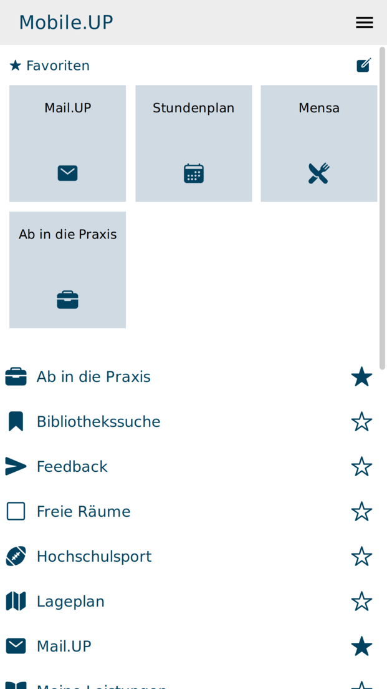

# Mobile.UP



Verfügbar für [Android](https://play.google.com/store/apps/details?id=de.floriangoessler.upapp) und [iOS](https://itunes.apple.com/de/app/mobile.up/id541440873?mt=8).

Die ganze Uni in deiner Hand: Finde dich auf dem Campus zurecht, habe immer den aktuellsten Speiseplan der Mensen dabei, hole dir Infos aus dem Vorlesungsverzeichnis, schau in deinen Stundenplan, checke deine Leistungen und vieles mehr!

Features:

- aktueller Mensaplan
- deinen Stundenplan direkt aktuell aus PULS
- deine bisherigen Leistungen direkt aus PULS
- das gesamte Vorlesungsverzeichnis
- aktuelle News von AStA, Uni und Co.
- durchsuchbare Öffnungszeiten für Büros, Sekretariate, Bibliotheken, Mensas und mehr
- durchsuchbare Lagepläne der Campusse
- Raumpläne und freie Räume auf den Campussen
- Bus und Bahn von, zu und zwischen den Campussen
- direkter Link zum Hochschulsport
- Notrufnummern direkt zur Hand
- Bibliothekssuche und Personensuche
- Verlinkung von Mail.UP, Moodle.UP, Reflect.UP und dem UNIshop
- aktuelle Stellenangebote

Mobile.UP wird dir mit freundlicher Unterstützung deines AStA der Uni Potsdam präsentiert!

## Getting Started

Zum entwickeln wird Node.js benötigt:

```sh
##
## Repo Clonen
##
git clone https://github.com/University-of-Potsdam-MM/Mobile.UP.git

##
## Falls nicht vorhanden Ionic und Cordova installieren
##
npm install -g cordova ionic

##
## Submodule installieren und aktualisieren
##
git submodule update --init --recursive

##
## Abhängigkeiten mit NPM installieren
##
npm install

##
## Dokumentation erstellen
##
npm run compodoc

##
## Applikation im Browser mit Ionic starten
##
ionic serve
```

## Weiterführende Informationen

- [Wiki](https://github.com/University-of-Potsdam-MM/Mobile.UP/wiki)

## Demo Version

- [Mobile.UP](https://mobileup.uni-potsdam.de/)

## Dokumentation

- [GitHub-Pages](https://university-of-potsdam-mm.github.io/Mobile.UP/)

## Kontakt

Bei Interesse kontaktieren Sie mobileup-service@uni-potsdam.de

## CodeClimate

<a href="https://codeclimate.com/github/University-of-Potsdam-MM/Mobile.UP"></a>

## Support from [BrowserStack](https://www.browserstack.com/)

- https://www.browserstack.com/
- https://github.com/browserstack

## Lizenz

<a rel="license" href="http://creativecommons.org/licenses/by-nc-sa/4.0/"></a><br /><span xmlns:dct="http://purl.org/dc/terms/" property="dct:title">Mobile.UP</span> von <a xmlns:cc="http://creativecommons.org/ns#" href="https://github.com/University-of-Potsdam-MM/UP.App/" property="cc:attributionName" rel="cc:attributionURL">https://github.com/University-of-Potsdam-MM/UP.App/</a> ist lizenziert unter einer <a rel="license" href="http://creativecommons.org/licenses/by-nc-sa/4.0/">Creative Commons Namensnennung - Nicht-kommerziell - Weitergabe unter gleichen Bedingungen 4.0 International Lizenz</a>.
